<div align="center">

# REVORA

### Adaptive Revenue Recovery for Recurring Payments
Recover legitimate recurring-payment revenue intelligently — while deterministic safety rules remain in control.

[](https://github.com/vishalinipg/Revora)
[](https://github.com/vishalinipg/Revora)
[](https://github.com/vishalinipg/Revora)
[](https://github.com/vishalinipg/Revora)
[](https://nextjs.org/)
[](https://fastapi.tiangolo.com/)

</div>

> **Revora** is an adaptive recurring-payment recovery system that combines deterministic failure diagnosis and policy enforcement with interpretable ML propensity signals, constrained multilingual outreach, and simulation-based evaluation to recover revenue while avoiding futile retries and unsafe customer communication.

---

## 🔗 Project Links

| Resource | Description | Target |
| :--- | :--- | :--- |
| 🚀 **Live Demo** | Cloud-hosted web application | [https://revora-bice.vercel.app/](https://revora-bice.vercel.app/) |
| 💻 **GitHub Repository** | Source code, test suites & architecture documentation | [https://github.com/vishalinipg/Revora](https://github.com/vishalinipg/Revora) |
| 🎥 **Pitch / Demo Video** | Project overview and system demonstration | [https://www.youtube.com/@vishalinipg](https://www.youtube.com/@vishalinipg) |

---

## 🎯 Selected Track

* **Competition**: Razorpay Buildathon 2026
* **Track**: **Track 03 — AI Revenue Recovery**
* **Official Track Brief**:
  > *"Find revenue that’s slipping away and win it back — Build an agent that detects revenue at risk, determines the right intervention, and executes a bounded recovery workflow: from payment failures and checkout abandonment to overdue receivables."*

Revora addresses this challenge across four targeted recovery capabilities:
* 🔄 **Payment degradation → root cause → recovery action**: Deterministic diagnosis mapping raw failure codes to causal classifications and bounded actions.
* 🔁 **Failed-subscription recovery**: Adaptive lifecycle management for UPI AutoPay e-mandates and recurring card subscriptions.
* ⏱️ **Mandate retry sequencer**: Policy-governed retry scheduler with 24-hour mandatory cooldowns and strict 3-attempt caps.
* 🇮🇳 **Hinglish & Tanglish recovery**: Conversational Romanized mobile messaging tailored for Indian users with approved static fallbacks.

> 🎯 **Evaluation Alignment**: Aligned with the track's core standard to show measured money recovered across a batch with compliant escalation, deterministic stopping rules, and full auditability (evaluated in [📊 Evaluation & Results](#evaluation--results)).

---

## 📑 Table of Contents
1. [🔗 Project Links](#project-links)
2. [🎯 Selected Track](#selected-track)
3. [💡 Project Objectives — What does it solve?](#project-objectives--what-does-it-solve)
4. [⚠️ Problem Statement](#problem-statement)
5. [🚀 Solution](#solution)
6. [⚙️ How Revora Works](#how-revora-works)
7. [🏗️ System Architecture](#system-architecture)
8. [🤖 AI, Decision & Safety Architecture](#ai-decision--safety-architecture)
9. [🛠️ Build Challenges & Technical Obstacles](#build-challenges--technical-obstacles)
10. [📊 Evaluation & Results](#evaluation--results)
11. [🎬 Screenshots / Demo](#screenshots--demo)
12. [🧰 Technology Stack](#technology-stack)
13. [🧪 Testing & Verification](#testing--verification)
14. [📁 Repository Structure](#repository-structure)
15. [▶️ Setup & Local Development](#setup--local-development)
16. [⚠️ Limitations & Transparency](#limitations--transparency)
17. [🔮 Future Improvements](#future-improvements)
18. [👩‍💻 Builder](#builder)

---

## 💡 Project Objectives — What does it solve?

Revora was engineered to address four concrete objectives in recurring payment recovery:

1. **Recover Legitimate Recurring Revenue**: Distinguish recoverable soft failures from fatal errors to recover recurring subscriptions before cancellation.
2. **Eliminate Futile Retries**: Deterministically detect permanent failures (expired mandates, blocked accounts) to prevent wasted gateway fees and customer notification spam.
3. **Enforce Fintech Safety & Guardrails**: Ensure machine learning can advise but never independently authorize money-related operations.
4. **Deliver Culturally Natural Recovery Outreach**: Provide localized, conversational communication in English, Hinglish, and Tanglish with approved fallback guarantees.

---

## ⚠️ Problem Statement

### 🎯 TRACK 03: AI Revenue Recovery
> **Find revenue that’s slipping away and win it back**
> 
> Build an agent that detects revenue at risk, determines the right intervention, and executes a bounded recovery workflow: from payment failures and checkout abandonment to overdue receivables.
> 
> #### ⚡ WHY NOW
> Revenue loss rarely happens in one clean step. A payment degrades, a checkout gets abandoned, a subscription fails, or an invoice goes overdue. AI can now close the loop from detecting the problem to diagnosing it, choosing the right intervention, and recovering the money.
> 
> #### 🧭 EXAMPLE DIRECTIONS
> * `+` **Payment degradation → root cause → recovery action** *(Addressed by Revora)*
> * `+` Checkout drop-off recovery
> * `+` **Failed-subscription recovery** *(Addressed by Revora)*
> * `+` B2B receivables chaser
> * `+` **Mandate retry sequencer** *(Addressed by Revora)*
> * `+` **Hinglish voice recovery** *(Addressed by Revora via Romanized Hinglish & Tanglish)*
> * `+` Promise-to-pay tracker
> 
> #### 🏆 THE BAR
> *Don’t just identify the problem. Show measured money recovered across a batch, with compliant escalation, stopping rules, and an audit trail.*

---

### The Recurring Payment Failure Modes Revora Solves

In recurring subscription payments (UPI AutoPay & Cards), this degradation cycle triggers three critical failure modes:

#### 1. Revenue Leakage & Involuntary Churn
Payments fail due to transient, recoverable conditions: temporary balance shortfall on scheduled auto-debit dates, NPCI switch timeouts, or Additional Factor of Authentication (AFA) renewal prompts. Blind systems either retry immediately and fail, or abandon the customer—causing involuntary churn for users who intended to stay subscribed.

#### 2. The Cost and Friction of Futile Retries
Not every failed payment can or should be retried. Hard failures—such as expired e-mandates, bank cancellations, or blocked accounts—cannot succeed through simple re-attempts. Blind retry engines repeatedly hit dead accounts, generating unnecessary gateway fees, triggering bank penalties for customers, and damaging merchant authorization standing with card networks.

#### 3. The Fintech AI Safety Paradox
Applying unconstrained generative AI or black-box neural networks directly to payment operations introduces severe operational hazards: hallucinating retries on blocked accounts, altering transaction amounts, or generating outreach copy that solicits sensitive credentials (CVVs, passwords, or UPI PINs). Fintech systems require absolute deterministic boundaries.

---

## 🚀 Solution

Revora closes the loop from detection to recovery through a **bounded four-step workflow** anchored by four architectural pillars:

```
[1. Detect Problem]    ──► Revenue-at-Risk Engine captures failure codes & rail metadata
[2. Diagnose Root]     ──► Deterministic taxonomy classifies Soft, Actionable, or Hard-Blocked
[3. Choose Action]     ──► Calibrated ML propensity signal + deterministic policy gate
[4. Recover Revenue]   ──► Constrained multilingual outreach + simulated outbox resolution
```

```
┌─────────────────────────────────────────────────────────────────────────┐
│                           REVORA SOLUTION PILLARS                       │
├───────────────────────────────┬─────────────────────────────────────────┤
│ 1. Failure-Aware Diagnosis    │ Deterministic categorization into Soft,  │
│                               │ Actionable, or Hard-Blocked taxonomy.   │
├───────────────────────────────┼─────────────────────────────────────────┤
│ 2. Predictive Propensity      │ Calibrated ML score with transparent    │
│                               │ log-odds factor contributions.          │
├───────────────────────────────┼─────────────────────────────────────────┤
│ 3. Deterministic Policy Gate  │ Absolute financial veto, retry limits,  │
│                               │ 24h cooldowns, and stopping rules.      │
├───────────────────────────────┼─────────────────────────────────────────┤
│ 4. Safe Multilingual Outreach │ English, Hinglish, & Tanglish messaging │
│                               │ with immutable amounts & zero PIN/CVVs. │
└───────────────────────────────┴─────────────────────────────────────────┘
```

> 💡 **Core Principle**: *AI informs. Deterministic policy decides. Safety validators control communication.*

---

## ⚙️ How Revora Works

Revora processes failed recurring payments through an auditable six-stage pipeline:

```
Stage 1: Detect [OBSERVED] ──► Stage 2: Diagnose [DECISION] ──► Stage 3: Score [SIGNAL]
                                                                        │
Stage 6: Audit [SIMULATION] ◄── Stage 5: Outreach [CONSTRAINED] ◄── Stage 4: Decide [DECISION]
```

* **Stage 1 — Revenue-at-Risk Detection `[OBSERVED]`**: Ingests failed debit events using Tier 1 operational signals: error codes (`insufficient_funds`, `bank_timeout`, `blocked_account`), rail type (UPI AutoPay vs. Card), attempt count, and customer tenure.
* **Stage 2 — Failure Diagnosis & Taxonomy `[DECISION]`**: Deterministically classifies the failure into **Soft Recoverable** (transient balance/network issue), **Customer-Actionable** (requires customer update or AFA approval), or **Hard-Blocked** (fatal mandate/account error).
* **Stage 3 — ML Propensity Scoring `[SIGNAL ONLY]`**: Calibrated Logistic Regression model calculates a continuous Propensity-to-Pay score ($0.000$ to $1.000$) and generates human-readable factor contributions.
* **Stage 4 — Revora Decision Engine `[DECISION]`**: Synthesizes diagnosis and propensity against hard-coded fintech rules: 3-attempt ceiling, mandatory 24-hour cooldown, ₹15,000 high-value step-up policy, and immediate stopping on fatal errors.
* **Stage 5 — Multilingual Outreach Generation `[CONSTRAINED OUTREACH]`**: When customer action is required, drafts localized copy (English, Hinglish, Tanglish) protected by template locks and a regex-based credential safety validator.
* **Stage 6 — Mock Outbox & Audit Log `[SIMULATION ONLY]`**: Records actions to a mock outbox with explicit simulation watermarks; resolves outcomes via the causal simulation oracle.

---

## 🏗️ System Architecture

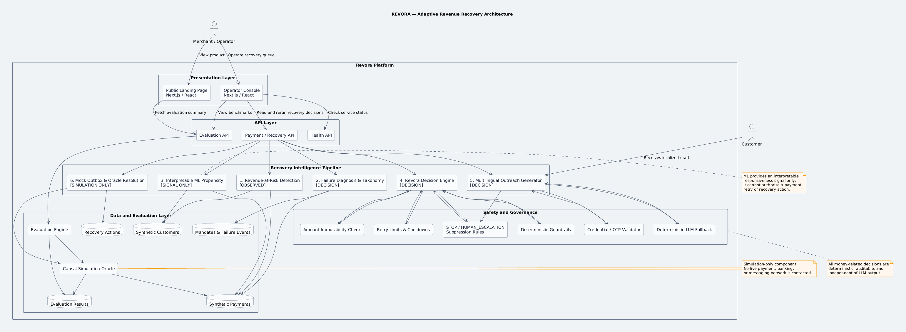

### Key Architectural Principles
1. **Observed Data vs. Simulation Oracle**: Latent ground-truth data exists exclusively inside the simulation oracle (`backend/app/evaluation/`). The operational pipeline and feature extractor have zero access to future counterfactuals.
2. **Signal vs. Authority**: Machine learning and language models generate advisory signals and draft text. Only deterministic code holds the authority to authorize financial state transitions.
3. **Execution Sandbox**: The entire pipeline operates in an isolated environment with simulated outboxes, operating without real financial or external communication side-effects.

---

## 🤖 AI, Decision & Safety Architecture

In **Track 03 — AI Revenue Recovery**, machine learning provides adaptive intelligence while remaining safely bounded. Revora defines clear operational boundaries between predictive signals, deterministic authority, and communication safety.

### 1. End-to-End Authority Pipeline
```
Observed Signals ──► Failure Diagnosis ──► ML Propensity ──► Deterministic Policy ──► Safety Validator ──► Mock Outbox
   [Observed]           [Decision]         [Signal Only]           [Decision]           [Sanitization]     [Simulation]
```

### 2. The AI Role: Calibrated Propensity Scoring
* **What it Predicts**: Propensity-to-Pay score ($0.000$ to $1.000$) estimating the probability of payment recovery upon user prompt.
* **Model Architecture**: Calibrated Logistic Regression (`scikit-learn`) where Platt scaling calibrates the model's raw probabilities against observed recovery outcomes.
* **Observed Features (Tier 1)**: Customer tenure, consecutive successful cycles, payment rail, attempt count, normalized invoice amount, and failure category.
* **Explainability**: Outputs exact log-odds contributions ($\text{logit}(p) = \beta_0 + \sum \beta_i x_i$) translated into human-readable factor waterfalls (e.g., `+0.42 log-odds from tenure >= 12 months`).
* **Strict Prohibitions**: The ML model **cannot** authorize a debit, override a `STOP`, alter invoice amounts, bypass retry caps, or message customers directly.

### 3. Decision Authority: Deterministic Policy Engine
* **Retry Ceilings**: Enforces a strict maximum of 3 collection attempts per payment lifecycle.
* **Mandatory Cooldowns**: Requires a minimum 24-hour spacing between automated retries to protect customer accounts from bank penalty fees.
* **Hard Stopping**: Fatal failure codes (`blocked_account`, `expired_mandate`, `revoked_mandate`) trigger immediate `STOP` or `HUMAN_ESCALATION`, completely overriding any ML score.
* **Amount Immutability**: Invoice amounts are bound directly from database records as read-only fields; no AI component can modify currency or amount values.

### 4. Multilingual Outreach & Cultural Safety
Revora supports conversational Romanized Hinglish and Tanglish messaging designed for familiar mobile communication, alongside standard English.

| Language | Code | Cultural Framing | Tone | Safe Fallback |
| :--- | :--- | :--- | :--- | :--- |
| **English** | `en` | Direct enterprise communication | Courteous & concise | Standard English |
| **Hindi / Hinglish** | `hi_hinglish` | Conversational Romanized Hindi (*"Namaste... payment update karein"*) | Respectful & urgent | English (`en`) |
| **Tamil / Tanglish** | `ta_tanglish` | Conversational Romanized Tamil (*"Vanakkam... payment update seyyavum"*) | Respectful & urgent | English (`en`) |

* **Zero Credential Solicitations**: A regex-based credential safety validator scans all outbound text for terms like `cvv`, `pin`, `otp`, `password`, or `card number`. Any match immediately blocks the message.
* **Outreach Suppression**: On `STOP` or `HUMAN_ESCALATION`, automated customer outreach is completely suppressed (`outreach_suppressed = true`).
* **Approved Deterministic Fallback**: If an LLM or template generator fails or violates safety rules, the system immediately defaults to approved static copy.
* **Ground-Truth Data Isolation**: Causal counterfactual labels (whether a customer truly has funds or would churn) are quarantined in the evaluation oracle, backed by automated leakage unit tests (`tests/test_leakage.py`).

---

## 🛠️ Build Challenges & Technical Obstacles

During development, four fundamental engineering challenges were addressed:

| Challenge | Technical Obstacle | Solution | Outcome |
| :--- | :--- | :--- | :--- |
| **Fintech AI Safety** | Probabilistic ML/LLMs could authorize unsafe retries or solicit credentials | Deterministic policy supremacy & regex credential validator | Financial execution authority is isolated in deterministic policy code; zero credential solicitations |
| **Evaluation Leakage** | Causal oracle labels could contaminate feature extractor | Tiered data isolation & automated leakage unit tests | Benchmark integrity protected through explicit ground-truth isolation; zero data leakage |
| **Multilingual Recovery** | Romanized conversational copy vs. credential and amount safety | Constrained templates + immutable string interpolation | Culturally natural Hinglish/Tanglish with locked amounts |
| **Dense Operator UX** | Multi-column payment queues caused table clipping & cramped viewing | Expansive full-width queue + dedicated `/console/inspect/[id]` | Streamlined triage with zero horizontal truncation |

---

## 📊 Evaluation & Results

> **Methodological Disclosure**: All evaluation metrics reported below are **synthetic simulation/evaluation results** derived from a chronologically held-out test cohort of 180 recurring payment events. They demonstrate architectural efficacy in a controlled sandbox and do not represent real-world merchant production figures.

### 1. Primary Benchmark (Seed 42 vs. Fixed 3-Attempt Blind-Retry Baseline)

Revora was benchmarked against a **fixed 3-attempt blind-retry baseline** without failure diagnosis or customer outreach.

| Benchmark Metric | Revora Adaptive Policy | Fixed-Policy Baseline | Delta / Lift |
| :--- | :--- | :--- | :--- |
| **Cohort Size (Held-Out Test)** | 180 payments | 180 payments | Exact cohort match |
| **Total Revenue at Risk** | ₹1,094,978.07 | ₹1,094,978.07 | Same baseline exposure |
| **Recovered Payments** | **152** | 119 | **+33 payments (+27.7%)** |
| **Unresolved Payments** | **28** | 61 | **-33 unresolved (-54.1%)** |
| **Revenue Recovery Rate** | **85.18%** | 65.57% | **+19.61 percentage points (+29.9% rel)** |
| **Total Amount Recovered** | **₹932,677.51** | ₹717,968.99 | **+₹214,708.52 net lift** |
| **Interventions Attempted** | **254** | 325 | **-71 total touches (-21.9%)** |
| **Interventions / Recovery** | **1.67** | 2.73 | **1.06 fewer touches per win** |
| **Futile Retries Avoided** | **113** | 0 | **113 wasteful retries eliminated** |
| **Stopping-Rule Compliance** | **100.0%** | 100.0% | Strict adherence |

> 📌 **Metric Clarification**: **Interventions attempted** measures all recovery actions (retries + outreach) initiated by the policy (-71 total touches vs baseline). **Futile retries avoided (113)** specifically measures blind retry attempts that the baseline would have executed on dead accounts or expired mandates where Revora deterministically halted execution.

### 2. Multi-Seed Robustness (5 Independent Seeds)

Evaluated across five random seeds (`42`, `100`, `555`, `2026`, `9999`):

| Statistical Metric | Revora (Mean ± Std) | Baseline (Mean ± Std) | Mean Advantage |
| :--- | :--- | :--- | :--- |
| **Revenue Recovery Rate** | **84.10% ± 1.85%** | 66.30% ± 2.94% | **+17.80 percentage points** |
| **Total Amount Recovered** | **₹920,877.76 ± ₹20,287** | ₹725,970.02 ± ₹32,252 | **+₹194,907.74 incremental** |
| **Interventions Attempted** | **262.6 ± 6.7** | 325.2 ± 11.7 | **19.2% fewer interventions** |
| **Oracle Concordance Rate** | **85.56% ± 0.00%** | 49.44% ± 0.00% | **+36.12 percentage points oracle concordance** |

### Verification Snapshot

| Verification Layer | Scope | Result | Status |
| :--- | :--- | :---: | :---: |
| **Backend Test Suite** | 65 regression & isolation tests | 65 / 65 Passed | ✅ Verified |
| **Landing Page E2E** | 8 Puppeteer browser checks | 8 / 8 Passed | ✅ Verified |
| **Operator Console E2E** | 9 Puppeteer workstation checks | 9 / 9 Passed | ✅ Verified |
| **Production Build** | Next.js 16 App Router bundle | 0 errors, 0 warnings | ✅ Verified |

---

## 🎬 Screenshots / Demo

The screenshots below illustrate the complete recovery workflow implemented in Revora, leading with the operator console workstation.

### 1. Operator Console & Full-Length Queue
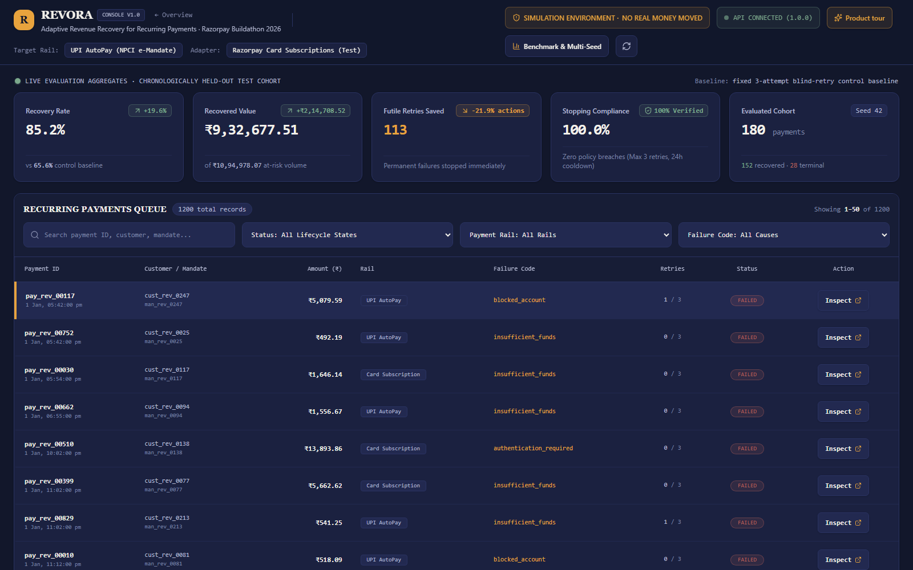
*The operator dashboard displaying KPI cards, recovery metrics, and the full-length Recurring Payments Queue.*

### 2. Payment Queue Filtering & Controls
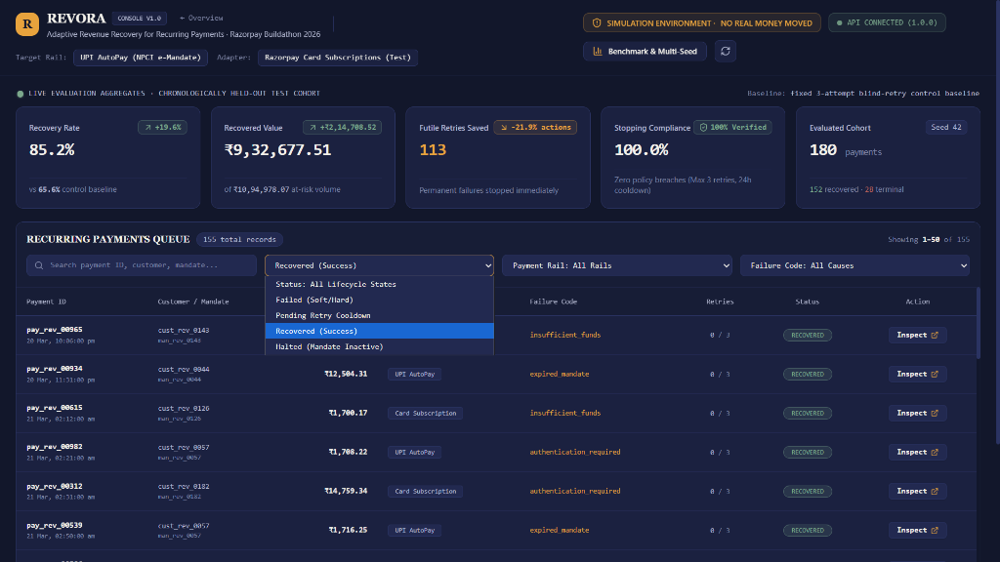
*Spacious payment queue with instant filtering across Status, Rails, and Failure Codes with dedicated Inspect actions.*

### 3. Dedicated Payment Inspection Workstation
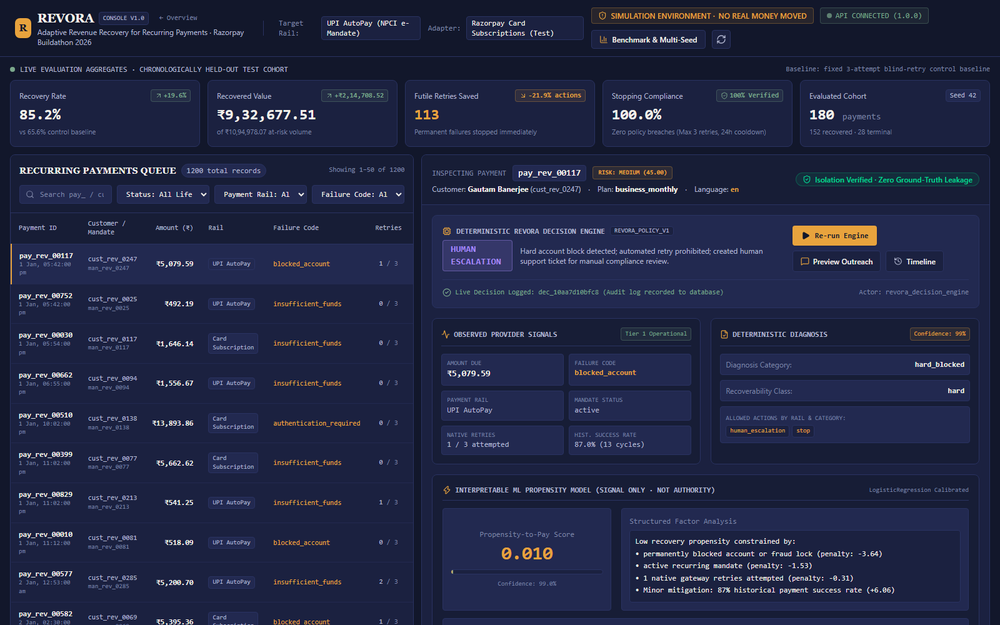
*Dedicated `/console/inspect/[id]` page displaying deterministic policy execution, observed signals, diagnosis, and ML propensity scoring.*

### 4. Customer Audit Timeline
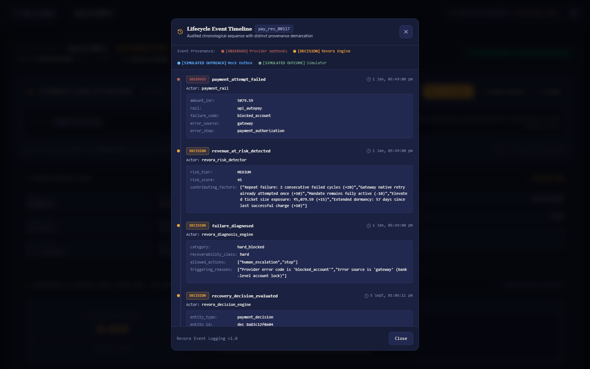
*Customer audit timeline showing observed failure signals, diagnosis classification, and policy decisions.*

### 5. Simulated Multilingual Outbox Preview
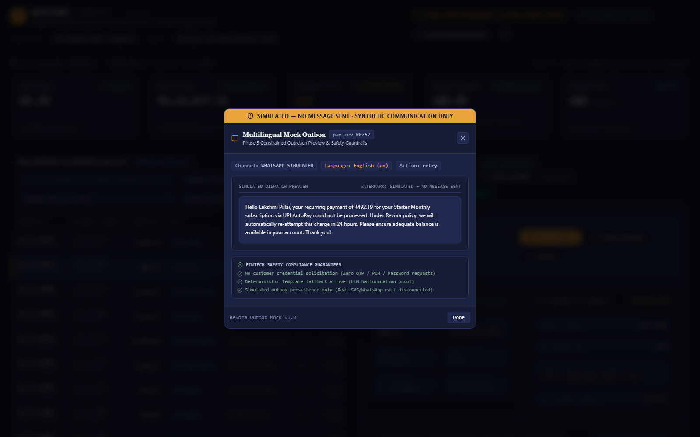
*Constrained outreach preview with safety watermark banner and tokenized payment update link.*

### 6. Outreach Suppression Enforcement
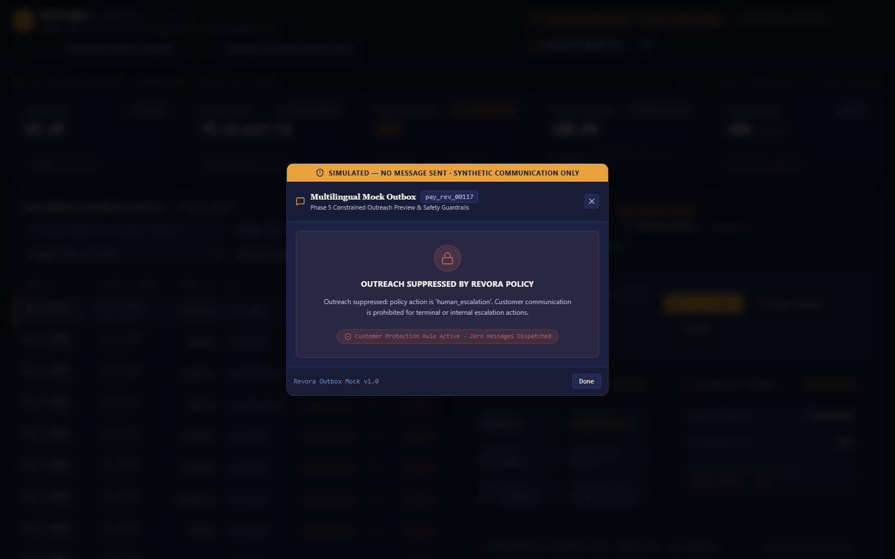
*Verified policy suppression preventing customer communication on fatal hard-blocked accounts.*

### 7. Multi-Seed Robustness Benchmark Modal
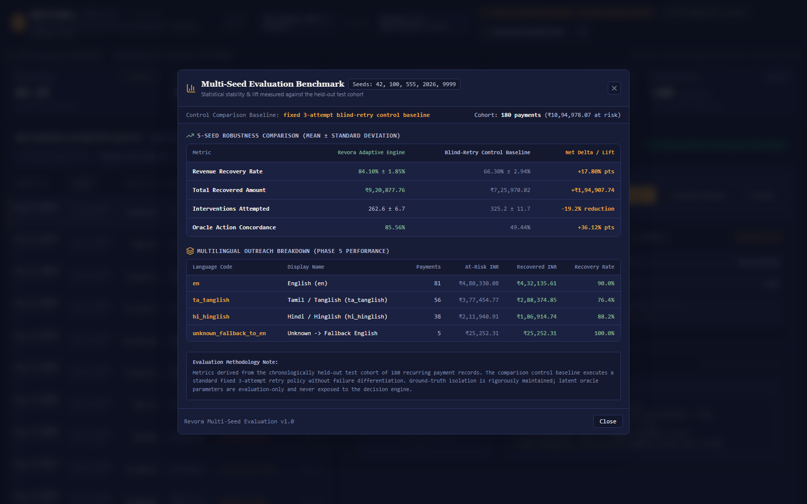
*Five-seed statistical robustness table comparing Revora against the fixed 3-attempt blind-retry control baseline.*

### 8. Public Landing Page Hero
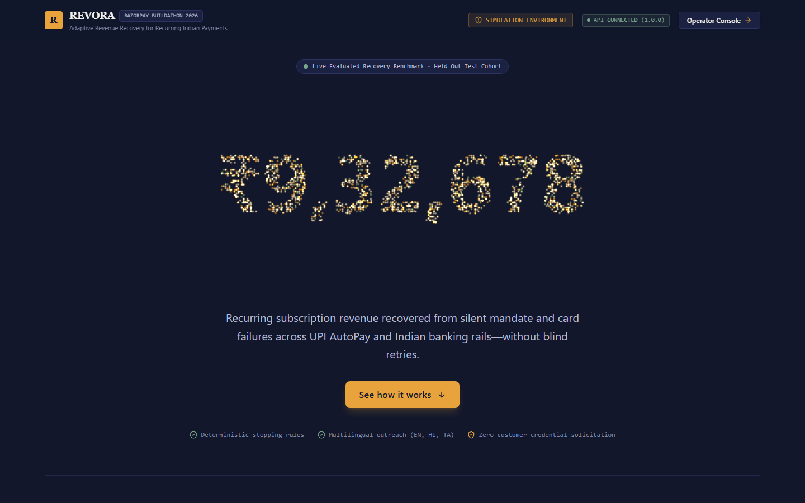
*Public landing page with Three.js particle hero displaying ₹9,32,678 evaluation recovery figure.*

### 9. Six-Stage Recovery Mechanism Diagram
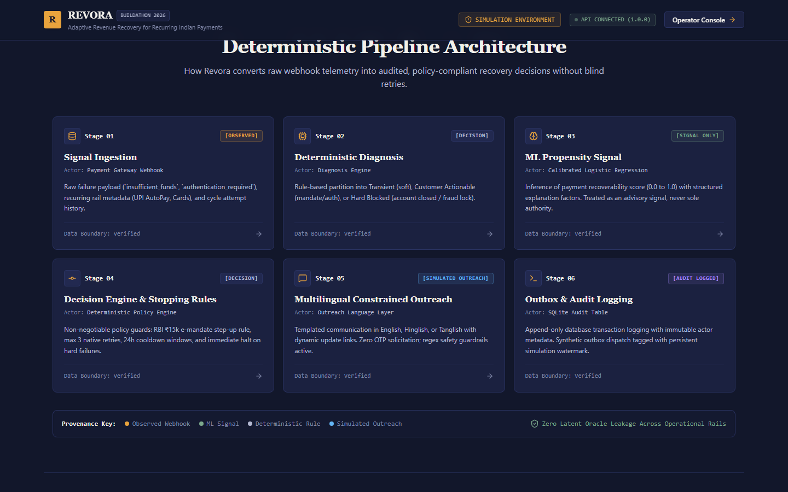
*Visual breakdown of the six operational stages from risk detection to audit logging.*

### 10. Multilingual Language Proof
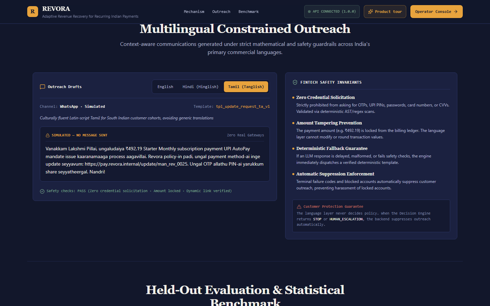
*Verified multilingual copy cards in English, Hinglish, and Tanglish with safety guardrail guarantees.*

### 11. Evaluation Metrics Report
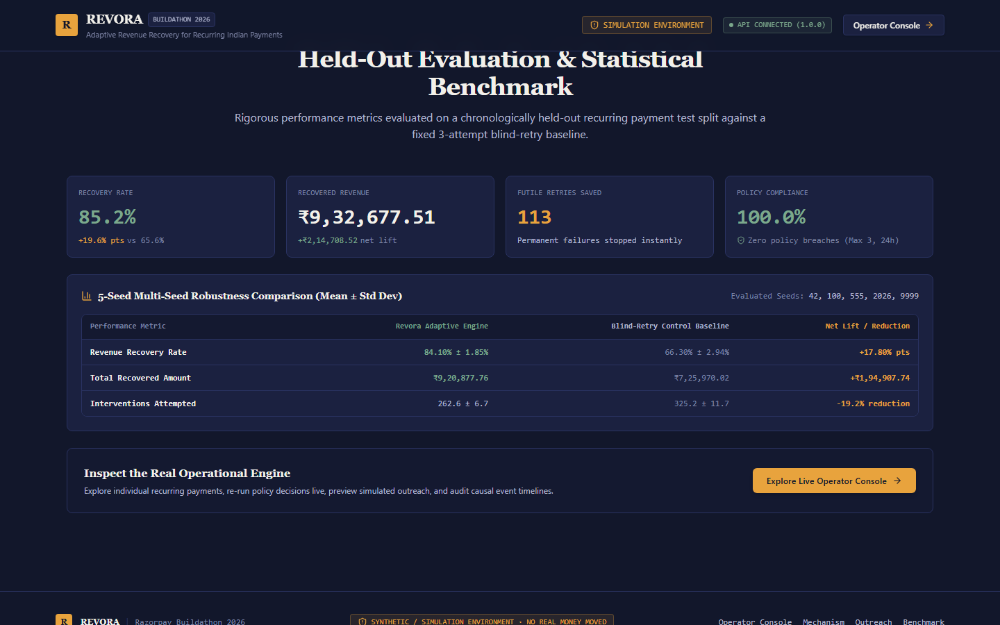
*Comparative evaluation metrics and 5-seed statistical robustness summary on the public landing page.*

### 12. Accessibility & Reduced Motion Mode
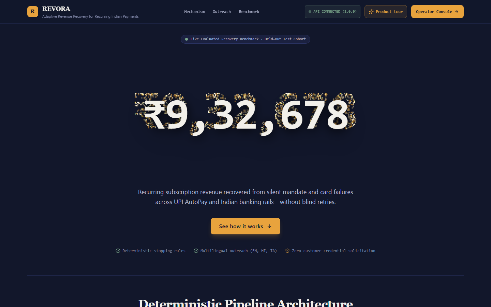
*Accessible static layout adhering to prefers-reduced-motion criteria.*

---

## 🧰 Technology Stack

| Layer | Technologies | Role in Revora |
| :--- | :--- | :--- |
| **Frontend Framework** | **Next.js 16 (App Router), React 19** | Static landing page and dynamic operator routes |
| **UI & Styling** | **Tailwind CSS, Lucide React, Outfit** | High-density fintech console, responsive data grids |
| **3D Visualization** | **Three.js** | Interactive hero particle constellation on landing page |
| **Backend Framework** | **Python 3.11, FastAPI, Uvicorn** | Asynchronous REST API services |
| **Data & Schemas** | **Pydantic v2, SQLAlchemy 2.0** | Typed API contracts and relational database models |
| **Database** | **SQLite 3** | Persistence for payments, mandates, and audit logs |
| **Machine Learning** | **Scikit-learn, NumPy, Joblib** | Calibrated Logistic Regression propensity model |
| **Testing & Automation** | **Pytest, Puppeteer (Node.js)** | 65 backend unit tests and 17 browser E2E tests |

---

## 🧪 Testing & Verification

Revora is verified through a complete test suite spanning backend logic, production bundling, and automated browser workflows:

| Verification Suite | Scope | Result | Execution Command |
| :--- | :--- | :---: | :--- |
| **Backend Regression** | Decision engine, diagnosis, ML leakage, stopping rules, APIs | **65 / 65 PASSED** | `python -m pytest -v` |
| **Frontend Production Build** | TypeScript compilation, Turbopack bundling, static generation | **0 errors, 0 warnings** | `npm run build` *(in /frontend)* |
| **Operator Console E2E** | Full queue, dedicated inspection, live re-run, timeline, outbox modals | **9 / 9 PASSED** | `node scripts/e2e_verify_dashboard.js` |
| **Landing Page E2E** | Particle hero, numeral detection, language proof, /console navigation | **8 / 8 PASSED** | `node scripts/e2e_verify_landing.js` |

### Execute Full Verification Suite
```bash
# 1. Run backend pytest suite
python -m pytest -v

# 2. Run production frontend build
cd frontend && npm run build && cd ..

# 3. Run Puppeteer E2E tests (requires running backend on :8000 and frontend on :3000)
node scripts/e2e_verify_dashboard.js
node scripts/e2e_verify_landing.js
```

---

## 📁 Repository Structure

```
Revora/
├── backend/
│   ├── app/
│   │   ├── api/                   # FastAPI endpoints (payments, decisions, outreach, evaluation)
│   │   ├── decision/              # Deterministic Decision Engine & rules
│   │   ├── detection/             # Failure taxonomy & revenue-at-risk detection
│   │   ├── evaluation/            # Benchmark metrics engine & causal simulation oracle
│   │   ├── language/              # Multilingual generator, templates, & safety validator
│   │   ├── ml/                    # Feature extractor & propensity inference model
│   │   ├── models/                # SQLAlchemy database entities
│   │   ├── schemas/               # Pydantic v2 request/response schemas
│   │   └── main.py                # FastAPI entry point & CORS configuration
│   └── tests/                     # 65 comprehensive backend tests
├── data/
│   ├── models/                    # Serialized ML model (revora_propensity_v1.pkl)
│   └── revora.db                  # Relational SQLite database
├── docs/
│   └── screenshots/               # Verified UI screenshots & architecture diagram
├── frontend/
│   ├── src/
│   │   ├── app/
│   │   │   ├── page.tsx           # Public landing page (Three.js hero & evaluation report)
│   │   │   ├── console/
│   │   │   │   ├── page.tsx       # Operator console & full-length payments queue
│   │   │   │   └── inspect/[id]/  # Dedicated full-screen payment inspection page
│   │   │   └── globals.css        # Design tokens & typography
│   │   └── components/            # Reusable UI components
│   └── package.json
├── reports/                       # Machine-readable evaluation reports (JSON & Markdown)
├── scripts/                       # Puppeteer E2E test scripts & evaluation runner
├── requirements.txt               # Backend Python dependencies
└── README.md                      # Project documentation
```

---

## ▶️ Setup & Local Development

### Prerequisites
* **Python**: 3.11 or higher
* **Node.js**: v18.0.0 or higher
* **Git**

> ℹ️ **Simulation Mode**: Revora runs entirely in a deterministic simulation environment. **No real payment gateway credentials, Razorpay API keys, WhatsApp tokens, or banking logins are required.**

### Quick Start

```bash
# Clone the repository
git clone https://github.com/vishalinipg/Revora.git
cd Revora
```

#### Terminal 1 — Backend (FastAPI)
```bash
# Install Python dependencies
pip install -r requirements.txt

# Launch FastAPI backend server (port 8000)
python -m uvicorn backend.app.main:app --host 127.0.0.1 --port 8000
```
* Backend Health: [http://127.0.0.1:8000/health](http://127.0.0.1:8000/health)
* Interactive Swagger Docs: [http://127.0.0.1:8000/docs](http://127.0.0.1:8000/docs)

#### Terminal 2 — Frontend (Next.js)
```bash
cd frontend

# Install Node dependencies
npm install

# Start Next.js development server (port 3000)
npm run dev
```

### Local URLs
* **Public Landing Page**: [http://127.0.0.1:3000/](http://127.0.0.1:3000/)
* **Operator Console**: [http://127.0.0.1:3000/console](http://127.0.0.1:3000/console)
* **FastAPI Backend**: [http://127.0.0.1:8000](http://127.0.0.1:8000)

---

## ⚠️ Limitations & Transparency

In the spirit of honest fintech engineering and academic transparency:

1. **Synthetic Data**: All payment IDs, customer records, mandate IDs, and transaction histories were synthetically generated to model common failure modes in Indian recurring payment rails (UPI AutoPay and card subscriptions).
2. **Simulation Environment**: All outcomes, recoveries, and timeline events are executed in a simulated causal environment. **No real money is moved**, no real bank accounts are debited, and no live telecommunication networks (SMS/WhatsApp) are contacted.
3. **Evaluation Boundaries**: Metrics reported in benchmark tables reflect synthetic cohort simulations; they should not be construed as real-world production revenue guarantees.
4. **Regulatory Guardrails**: References to RBI circulars or NPCI e-mandate rules represent engineering design guardrails implemented within software logic; they do not constitute formal regulatory certification or endorsement by RBI or NPCI.

---

## 🔮 Future Improvements

* **Production Payment Gateway Adapters**: Real-time webhook ingestion for live Razorpay Subscriptions and UPI AutoPay APIs.
* **Configurable Merchant Policy Studio**: Web-based policy editor allowing merchants to customize cooldown hours and retry ceilings per plan tier.
* **Expanded Regional Language Support**: Extending conversational models to Marathi, Telugu, Bengali, and Kannada.
* **Human-in-the-Loop Escalation Console**: Dedicated operator queue for reviewing high-value payments flagged for manual compliance review.
* **Adversarial Safety Testing**: Automated prompt-injection testing suites to continuously stress-test LLM outreach validators.

---

## 👩‍💻 Builder

**Vishalini P G**

REVORA was developed independently for the **Razorpay Buildathon 2026** — **Track 03: AI Revenue Recovery**.
